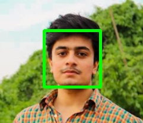

# <center> FACE DETECTION USING OPENCV <center>

#### Importing Libraries


```python
import cv2
```

#### Reading Cascade file


```python
face_cascade = cv2.CascadeClassifier(cv2.data.haarcascades + 'haarcascade_frontalface_default.xml')
# This will create cascade classifier object.
```

#### Now we can use this cascade object to identify face in our image

#### Now loading the Image


```python
img = cv2.imread("Photo.png")
```

#### Note: Grayscale Image is good for searching for face in image
    


```python
gray_img = cv2.cvtColor(img,cv2.COLOR_BGR2GRAY)
```


```python
cv2.imshow("Gray_Image",gray_img)
cv2.waitKey(0)
```


    -1


##### Saving th output image in new file


```python
cv2.imwrite("Gray_Image.jpg",gray_img)
```


    True


```python
faces = face_cascade.detectMultiScale(gray_img,scaleFactor = 1.05,minNeighbors=5) 
```


```python
print(faces)
print(type(faces))
```

    [[74 51 95 95]]
    <class 'numpy.ndarray'>
    

#### Now, drawing Green rectangle on the Image to point out the face


```python
for x,y,w,h in faces:
    img =cv2.rectangle(img,(x,y),(x+w,y+h),(0,255,0),3)
```


```python
cv2.imshow("Face",img)
cv2.waitKey(0)
```


    -1


##### Saving the outout image in a new file


```python
cv2.imwrite("Face_detected.jpg",img)
```


    True




# END

# PROJECT BY: @YASIRKHANA


```python

```
